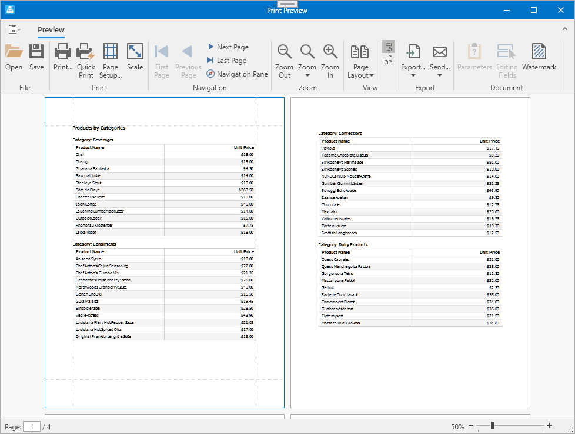

# Reporting for WPF - How to create a report in code

This example illustrates the process of creating a report in code in a WPF application. 

The following steps are essential to create a report layout:

1. Create a report class instance and [bind it to data](https://docs.devexpress.com/XtraReports/15034/detailed-guide-to-devexpress-reporting/bind-reports-to-data).
2. Add [bands](https://docs.devexpress.com/XtraReports/2587/detailed-guide-to-devexpress-reporting/introduction-to-banded-reports) to the report.
3. Add [controls](https://docs.devexpress.com/XtraReports/2605/detailed-guide-to-devexpress-reporting/use-report-controls) to the created bands and bind them to data.

After the report layout is complete, you can generate the report document and display it in the [Print Preview](https://docs.devexpress.com/XtraReports/15016/wpf-reporting/wpf-reporting-document-preview).

Starting with v.17.2, the report uses [binding expressions](https://docs.devexpress.com/XtraReports/1180/detailed-guide-to-devexpress-reporting/use-report-controls/bind-report-controls-to-data/specify-a-control-s-binding-expression) to bind controls to data. You can switch to the legacy binding mode by setting the [UserDesignerOptions.DataBindingMode](https://docs.devexpress.com/XtraReports/DevExpress.XtraReports.Configuration.UserDesignerOptions.DataBindingMode) property to <strong>Bindings</strong> at the application start.

## Files to Review

* [App.xaml.cs](CS/RuntimeReportsApplication/App.xaml.cs) (VB: [App.xaml.vb](VB/RuntimeReportsApplication/Application.xaml.vb))
* [MainWindow.xaml.cs](CS/RuntimeReportsApplication/MainWindow.xaml.cs) (VB: [MainWindow.xaml.vb](VB/RuntimeReportsApplication/MainWindow.xaml.vb))

## Documentation

- [WPF Reporting](https://docs.devexpress.com/XtraReports/9830/wpf-reporting)
- [Create a Report in Code](https://docs.devexpress.com/XtraReports/115726/detailed-guide-to-devexpress-reporting/reporting-api/create-reports-in-code)
- [Bind Reports to Data](https://docs.devexpress.com/XtraReports/15034/detailed-guide-to-devexpress-reporting/bind-reports-to-data)
- [Bind Report Controls to Data with Binding Expressions](https://docs.devexpress.com/XtraReports/1180/detailed-guide-to-devexpress-reporting/use-report-controls/bind-report-controls-to-data/specify-a-control-s-binding-expression)
## More Examples

- [Reporting for WPF - How to Implement a Report Storage](https://github.com/DevExpress-Examples/reporting-wpf-report-storage)
- [WPF Report Designer - How to register a custom page in the Report Wizard](https://github.com/DevExpress-Examples/Reporting_wpf-report-designer-how-to-register-a-custom-page-in-the-report-wizard-t600080)
- [Report Designer for WPF - How to enable end-users to load custom assemblies to the Entity Framework context](https://github.com/DevExpress-Examples/Reporting_report-designer-for-wpf-how-to-enable-end-users-to-load-custom-assemblies-to-the-t503673)
- [Report Designer for WPF - How to switch the Report Wizard to a single-query version](https://github.com/DevExpress-Examples/Reporting_report-designer-for-wpf-how-to-switch-the-report-wizard-to-a-single-query-version-t506224)

